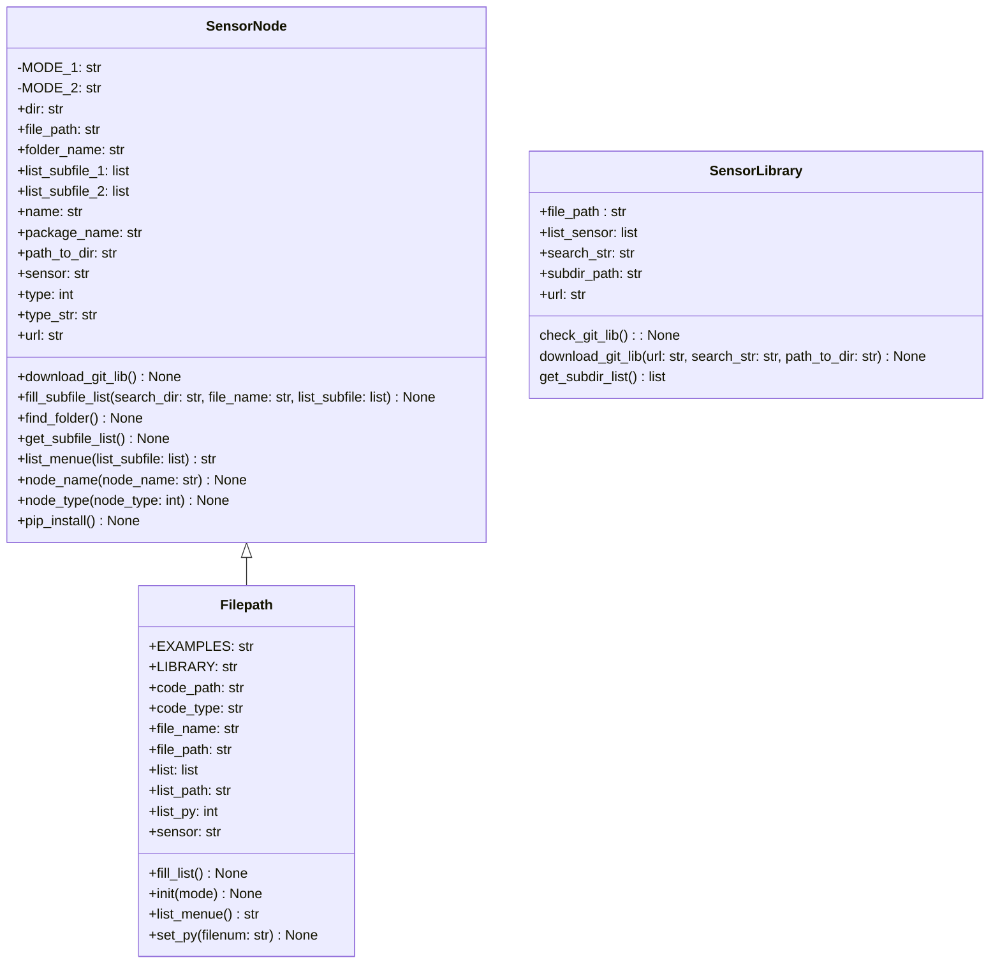

```mermaid
classDiagram
 
    SensorNode <|-- Filepath
    class SensorLibrary{
      +file_path : str
      +list_sensor: list
      +search_str: str
      +subdir_path: str
      +url: str
      check_git_lib(): None
      download_git_lib(url: str, search_str: str, path_to_dir: str) None
      get_subdir_list() list

    }
    class SensorNode{
      -MODE_1: str 
      -MODE_2: str 
      +dir: str
      +file_path: str 
      +folder_name: str
      +list_subfile_1: list 
      +list_subfile_2: list 
      +name: str 
      +package_name: str 
      +path_to_dir: str 
      +sensor: str 
      +type: int 
      +type_str: str
      +url: str 
      +download_git_lib() None
      +fill_subfile_list(search_dir: str, file_name: str, list_subfile: list) None
      +find_folder() None
      +get_subfile_list() None
      +list_menue(list_subfile: list) str 
      +node_name(node_name: str) None
      +node_type(node_type: int) None
      +pip_install() None

    }
    class Filepath{
      +EXAMPLES: str 
      +LIBRARY: str
      +code_path: str 
      +code_type: str 
      +file_name: str 
      +file_path: str 
      +list: list 
      +list_path: str 
      +list_py: int
      +sensor: str 
      +fill_list() None
      +init(mode) None
      +list_menue() str 
      +set_py(filenum: str) None
    }
```     