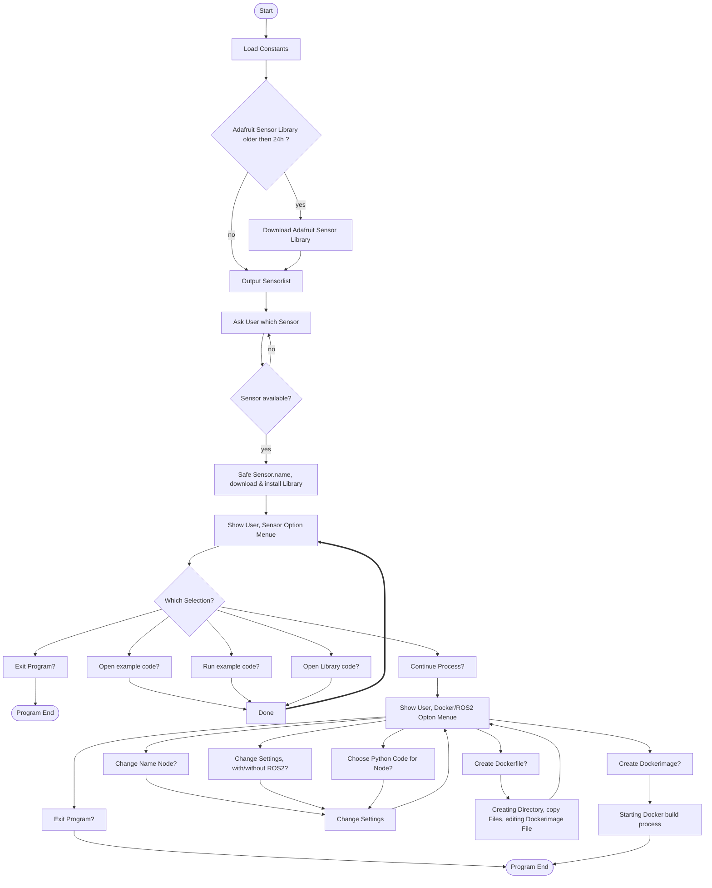

```mermaid
 flowchart TB
            A([Start]) --> B[Load Constants] 
            B --> C_0{ Adafruit Sensor Library older then 24h ?}
            C_0 -->|yes| C_1[ Download Adafruit Sensor Library] 
            C_0 -->|no| D[ Output Sensorlist]
            C_1 --> D
            D --> E[ Ask User which Sensor]
            E --> F{ Sensor available?}
            F -->|no| E
            F -->|yes| G[Safe Sensor.name, download & install Library]

            G --> H[Show User, Sensor Option Menue]
            H --> H11{Which Selection?}
            H11 --> H1[Open example code?]
            H11 --> H2[Run example code?]
            H11 --> H3[Open Library code?]
            H11 --> H4[Continue Process?]
            H11 --> H5[Exit Program?] --> XX([Program End])
            H1 --> HXX
            H2 --> HXX
            H3 --> HXX[Done] ==> H
         
            H4 -->I[Show User, Docker/ROS2 Opton Menue]
            I --> I1[Change Name Node?]
            I --> I2[Change Settings, with/without ROS2?]
            I --> I3[Choose Python Code for Node?]
            I --> I4[Create Dockerfile?]
            I --> I5[Create Dockerimage?]
            I --> I6[Exit Program?] --> XY([Program End])
            I1 -->I11[Change Settings]
            I2 -->I11
            I3 -->I11
            I11 -->I
            I4 -->J1[Creating Directory, copy Files, editing Dockerimage File] -->I
            I5 -->J2[Starting Docker build process] --> XY
            
```